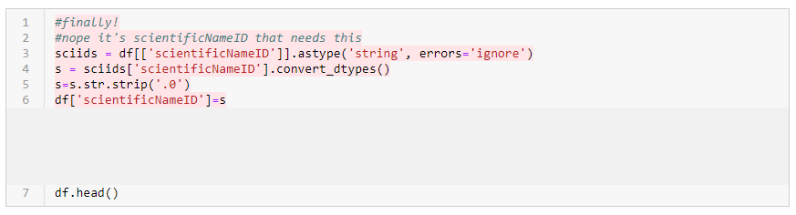
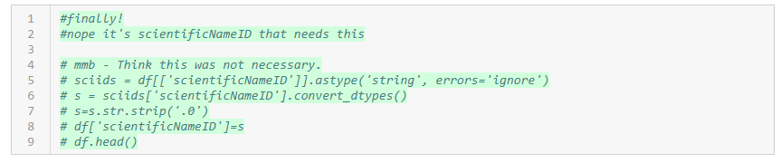
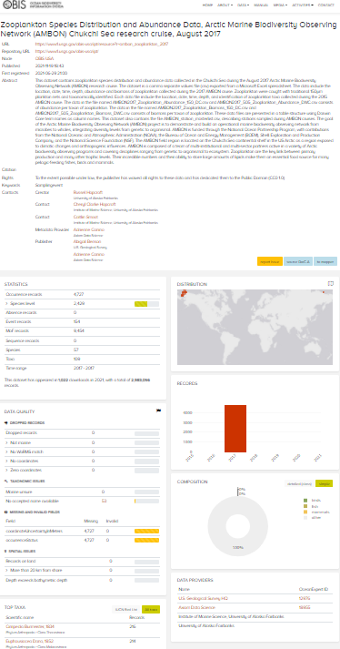

# Dealing with errors
Datasets can have a wide variety of errors that pop up during the darwin core alignment process. This chapter details
ways in which a data manager can identify, discuss, and resolve potential errors in the data.

It should be noted that, in most cases, the data manager/scientist aligning the data to darwin core should reach out
to the data originator to ensure the actions taken are not incorrectly representing the observations.

## Example using GitHub to resolve errors
1. Dataset sent to OBIS-USA via email.
2. OBIS-USA uploaded to IPT.
3. Once the data were uploaded, the IPT identified there was an issue with the `occurrenceID` field. The issue was then
presented and discussed in a GitHub ticket:
   
4. The data manager uploaded the raw data and code to GitHub through the pull request below. This included a fix for
the `occurrenceID` issue.
   
5. The OBIS node manager was notified of the availability of a revised dataset by pointing directly to the appropriate
commit in GitHub:
   
6. The OBIS node manager downloaded the data from the commit above and uploaded them to the IPT.
7. The IPT returned a summary of the dataset including that 434 records had invalid `scientificNameID` records in the
occurrence file.
8. After some data sleuthing, the data manager noticed that the code accidentally removed trailing zeros from
`scientificNameID` that ended in `0`:
   
9. So, the data manager updated the code to resolve the issue and generate a new occurrence file.
   
   1. Here is fixing the `scientificNameID` generation: 
   2. Here is removing the problematic code:  
10. The revised occurrence file was then resubmitted to the OBIS node manager by pointing them at the appropriate commit
record:
    
11. The OBIS node manager downloaded the data from the commit above and uploaded them to the IPT.
12. The IPT and OBIS landing page now indicated that no more issues with these data are present:
    